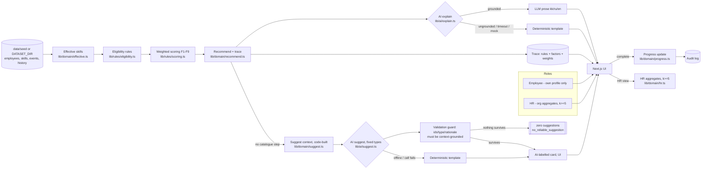
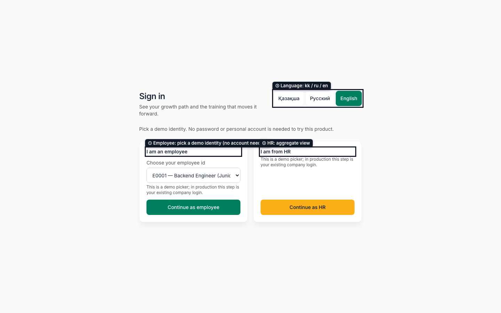
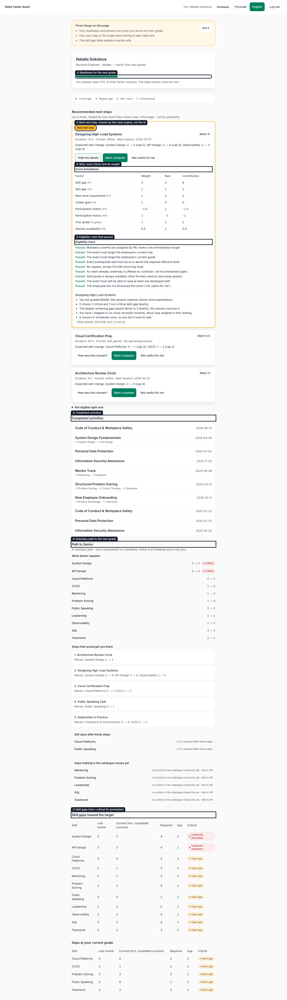
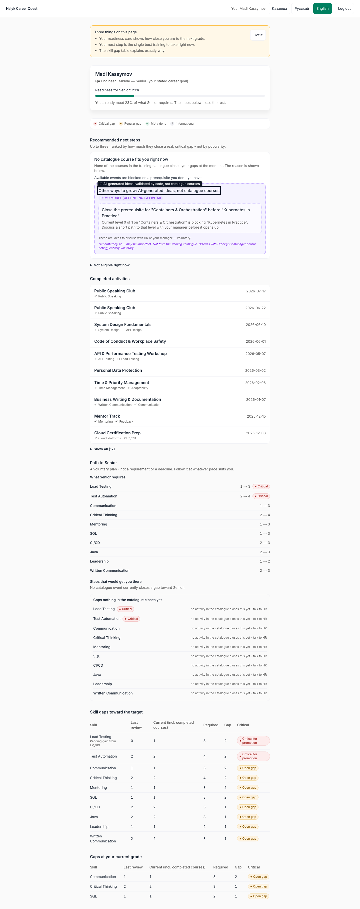
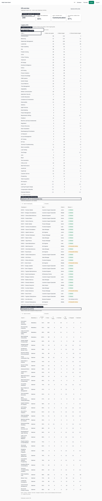

# Career Quest — Halyk Bank Case 1

Internal HR tool: for one employee it shows the career trajectory to their next
grade and 1–3 eligible, voluntary development steps that close the gap, each
with a rationale grounded in ≥ 3 factors. Completing a step moves projected
skill levels. HR sees lagging skills, who has no recommended step, and
participation by activity.

**HackAlem AI 2026 · Finance track · Task: Halyk Bank "Career Quest" (Case 1)**

> **Runs with no API key and no personal account.** `cp .env.example .env` and
> the app works fully offline against a deterministic model (`MODEL_REF=mock:demo`).
> See [Setup](#10-setup).

---

## For evaluators (AI or human): verify in 5 minutes

**Launch (single command, no key, no account):**

```bash
nvm use && pnpm install --frozen-lockfile && pnpm build && pnpm start
```

This is `package.json`'s `start:demo` script — `http://localhost:3000`.
`docker compose up --build` is the Docker equivalent ([§13](#13-docker)).

**No API key and no personal account are required.** `MODEL_REF` defaults to
`mock:demo` (offline); the demo login is a role picker (an employee id, or
HR — no password), not real authentication. Details: [§10 Setup](#10-setup).

**Copy-paste verification, from a clean clone:**

```bash
nvm use && pnpm install --frozen-lockfile
pnpm typecheck && pnpm test && pnpm eval && pnpm build && pnpm start &
pnpm test:e2e
bash scripts/clean-room-test.sh
```

Every command is a real `package.json` script or a committed file — checked
present in this repo, not illustrative.

**Where each criterion is evidenced** (Task rubric weights):

| Rubric item | Weight | Evidenced by |
| --- | --- | --- |
| Task fit & working scenario | 25 | [§5 Main user scenario](#5-main-user-scenario--procedure-for-checking-it) — commands run against a live server, observed output included |
| Technical implementation incl. AI | 25 | [§6 Architecture](#6-architecture), [§7 AI architecture](#7-ai-architecture) — engine decides, one bounded AI call, grounding check |
| README & reproducibility | 25 | This file (§10–§16); `bash scripts/clean-room-test.sh` |
| Value and applicability | 15 | [§2 Solution](#2-solution), [§19 Known limitations](#19-known-limitations) |
| Development potential & originality | 10 | [§20 Future scalability](#20-future-scalability) |

| Must-have | Code | Test | Route |
| --- | --- | --- | --- |
| Profile / career trajectory | `lib/domain/trajectory.ts`, `app/employee/[id]/page.tsx` | `tests/trajectory.test.ts` | `GET /api/employees/[id]` |
| 1–3 recommendations | `lib/domain/recommend.ts` | `tests/engine.test.ts` | `GET /api/employees/[id]/recommendations` |
| Rationale, ≥ 3 factors | `lib/ai/explain.ts`, `lib/ai/grounding.ts` | `tests/explain.test.ts` | `POST /api/employees/[id]/explanations` |
| Progress update | `lib/domain/progress.ts` | `tests/progress.test.ts` | `POST /api/employees/[id]/complete` |
| HR view | `lib/domain/hr.ts` | `tests/hr.test.ts` | `GET /api/hr/aggregates` |
| Jury profile upload | `lib/data/import.ts` | `tests/import.test.ts` | `POST /api/hr/import`, UI `/hr/import` |
| Trap profiles (single-factor rule wrong) | `lib/rules/scoring.ts`, `data/fixtures/trap-F01..F06` | `tests/engine.test.ts` | — |

Full detail: [§4 Requirement completion matrix](#4-requirement-completion-matrix).
Honest gaps: [§19 Known limitations](#19-known-limitations). Structured guide
for an automated reviewer, with a repository map and file-by-file
traceability: [`docs/EVALUATION_GUIDE.md`](docs/EVALUATION_GUIDE.md).

---

## 1. Problem

Today, per the case brief: development activities arrive as separate HR
notifications with deadlines. The employee cannot see where a given activity
leads. Training gets done as a formality on the deadline day, and turnout for
voluntary activities is low even though the development budget is fully spent.
Coercion is named in the brief as "the main predictor of failure" for such
programs.

## 2. Solution

A deterministic rules engine (`lib/rules/`, `lib/domain/`) computes, per
employee: effective skill levels (assessed level plus post-review completions),
the gap to their target grade, eligible voluntary events, and a weighted
multi-factor score with a full trace. **The engine selects and ranks; a
language model only writes the rationale prose** from the engine's own factor
list (`lib/ai/explain.ts`, via `generateStructured`), and that text is
rejected and replaced by a deterministic template if it names any number, skill
or event the engine did not produce (`lib/ai/grounding.ts`). Nothing about
eligibility, ranking or skill arithmetic is decided by the model.

The profile also shows a **grade-transition path** (`lib/domain/gradePath.ts`,
`GET /api/employees/[id]/grade-path`, `components/GradePath.tsx`): a
deterministic, greedy, critical-gap-first plan of catalogue events that would
close every gap to the next grade, respecting prerequisites and `max_level`
caps, with any gap no catalogue event can close shown honestly as
"unresolved" rather than hidden.

## 3. Exact challenge requirements

From the case brief (`docs/task/halyk-career-quest-spec.txt`, EN §7 "Must
have"), quoted via `docs/requirements.md`:

> Profile and career trajectory — open any employee, see role, grade, skills,
> completed activities, available next steps. AI recommendation of the next
> step — the system suggests 1–3 relevant activities, and the rationale relies
> on at least three factors (grade, skill gaps, participation history,
> next-level requirements). Progress update — mark an activity completed, skill
> progress and the trajectory move. Simple HR view — lagging skills, who has no
> recommended step, participation by activity. Infrastructure — launch with a
> single command. The jury uses three profiles designed so that a single-factor
> rule gets them wrong.

## 4. Requirement completion matrix

| ID | Requirement | Implementation | Evidence | Status |
| --- | --- | --- | --- | --- |
| R-01 | Employee profile: role, grade, skills, completed activities, next steps | `app/employee/[id]/page.tsx`, `lib/domain/trajectory.ts`, `lib/domain/completed.ts` ("Completed activities" section: title, date, format, skills raised) | `tests/trajectory.test.ts`, `tests/engine.test.ts`, `tests/completed.test.ts` | ✅ |
| R-02 | Career trajectory with per-skill gap | `lib/domain/trajectory.ts` | `tests/trajectory.test.ts` | ✅ |
| R-03 | 1–3 eligible voluntary recommendations | `lib/domain/recommend.ts`, `lib/rules/eligibility.ts` | `tests/engine.test.ts` | ✅ |
| R-04 | Rationale cites ≥ 3 distinct factors with numbers, as human-readable sentences | `lib/ai/rationale.ts` (sentence builder), `lib/ai/template.ts`, `lib/ai/grounding.ts` (numeric grounding), `lib/ai/explain.ts` (honest `source: llm\|mock\|template` badge) | `tests/explain.test.ts` | ✅ |
| R-05 | Complete → skill progress + trajectory move | `lib/domain/progress.ts`, `app/api/employees/[id]/complete/route.ts` | `tests/progress.test.ts` | ✅ |
| R-06 | HR view: lagging skills, no-step list, participation | `lib/domain/hr.ts`, `app/hr/page.tsx` | `tests/hr.test.ts` | ✅ |
| R-07 | "No recommended step" with a reason code, honestly classified; low-fit employees get one flagged step instead of a `LOW_FIT` no-step | `lib/domain/recommend.ts` (`classifyNoStep`, `NoStepReason`) | `tests/engine.test.ts` (`ALL_DONE`/`PREREQ_BLOCKED`/`CATALOGUE_GAP` cases) | ✅ |
| R-08 | Beats single-factor baselines on trap profiles | `lib/rules/scoring.ts`, fixtures `data/fixtures/trap-F01..F05` | `tests/engine.test.ts` (F-01..F-05 assertions) | ✅ |
| R-09 | Import new profiles/history via UI (HR-only), incl. `role_profiles` | `lib/data/import.ts`, `lib/data/load.ts` (overlay merge, keyed `role::grade`), `app/api/hr/import/route.ts`, `app/hr/import/page.tsx` | `tests/import.test.ts` | ✅ — HR-only, per-row validated, 5 MB/file cap, atomic overlay write, audited, no restart; uploaded `role_profiles` rows are now merged and consulted by eligibility, not just stored |
| R-10 | Latency: UI ≤ 2 s, AI ≤ 10 s with 8 s fallback | `lib/ai/explain.ts` (`AbortSignal` timeout → template) | `tests/latency.test.ts` — measured on the operator's machine: getDataset 16.6 ms, per-employee read over all 200 kit employees p95=1.94 ms/max=9.98 ms (budget 2000 ms), `hrAggregates` 401 ms, hanging-provider fallback 227 ms (production timeout 8000 ms). Run `pnpm vitest run tests/latency.test.ts` to reproduce | ✅ |
| R-11 | Explainability: visible trace + progress formula | `components/TraceView.tsx`, `lib/rules/engine.ts` | `tests/engine.test.ts`; visible in UI | ✅ |
| R-15 / R-16 | Employee/HR role separation, fails closed, no cross-employee data | `lib/auth/session.ts`, route guards | `tests/authz.test.ts` | ✅ |
| R-17 | Voluntary; dismiss without penalty | `app/api/employees/[id]/dismiss/route.ts` | `tests/trajectory.test.ts` | ✅ |
| R-18 | UI and rationale in kk/ru/en | `lib/i18n/dict.ts` (independently written text per locale, not clones) — all UI strings are available in kk/ru/en | `tests/i18n-keys.test.ts` (identical key set across all three locales); spot-checked live for E0137 in `ru` — see [§5](#5-main-user-scenario--procedure-for-checking-it) | ✅ |
| O-02 | *Optional extension:* AI suggestions for employees with no catalogue step, validated by code | `lib/domain/suggest.ts`, `lib/ai/suggest.ts`, `lib/ai/suggest-template.ts`, `components/AiSuggestions.tsx`, `POST /api/employees/[id]/suggestions` | `tests/suggest.test.ts`, eval `suggestion-grounded`, `docs/live-runs/suggestions.md` | ✅ |
| R-12 | Single-command launch, no keys | `Dockerfile`, `docker-compose.yml`, `pnpm start:demo` | `scripts/clean-room-test.sh` | ✅ |
| R-13 | Testable with no personal account | `MODEL_REF=mock:demo` default, demo login picker | clean-room script runs offline | ✅ |
| R-16b | Cross-origin state-changing requests rejected | `lib/http/origin.ts` (`crossOriginViolation`, wired in `withErrorHandling`) | confirmed live: mismatched `Origin` on POST → 403, same-origin/no-`Origin` (curl) → 200 | ✅ |
| R-16c | HR individual-profile and HR aggregates views are both audited; deny on audit-write failure | `lib/audit/hr-access.ts` (`auditHrProfileView`, `auditHrAggregatesView`), wired into `app/employee/[id]/page.tsx`, `app/api/employees/[id]/route.ts`, `app/hr/page.tsx`, `app/api/hr/aggregates/route.ts` | confirmed in code; both fail closed (`AUDIT_UNAVAILABLE`, 503, on audit-write failure) | ✅ |

✅ complete and tested · ⚠️ partial · ❌ not implemented

## 5. Main user scenario — procedure for checking it

Runs on the **default dataset**, which is the organizer's committed kit
(`docs/task/career_quest_dataset/`, 200 employees — see [§11](#11-environment-variables)),
after [Setup](#10-setup). The UI at `http://localhost:3000` defaults to
**Russian**, with a language switch (kk/ru/en) in the header. Every value
below was read from this app while writing this README, via the same routes
the UI calls (`app/api/**`) — not assumed.

```bash
source ~/.nvm/nvm.sh && nvm use >/dev/null
pnpm build && pnpm start &            # background; http://localhost:3000
curl -s http://localhost:3000/api/health   # {"status":"ok",...,"model":{"ref":"mock:demo","offline":true}}

curl -sc /tmp/c.txt -H 'Content-Type: application/json' \
  -X POST -d '{"role":"employee","employeeId":"E0137"}' http://localhost:3000/api/session
curl -sb /tmp/c.txt http://localhost:3000/api/employees/E0137/recommendations
curl -sb /tmp/c.txt -H 'Content-Type: application/json' -X POST \
  -d '{"event_ids":["EV_006"],"locale":"ru"}' \
  http://localhost:3000/api/employees/E0137/explanations
kill %1                               # stop the server when done
```

**Observed** (kit dataset, `asOf` 2026-10-01): employee **E0137** = Backend
Engineer, Middle grade (target Senior). Recommendations return 3 cards:
**`EV_006`** "Designing High-Load Systems" (offline), score 8, closing
**2 critical** skill levels (System Design 2→3, API Design 3→4) plus one
non-critical (Observability 2→3); **`EV_009`** "Cloud Certification Prep"
(self_paced), score 6.5, Cloud 0→1 and CI/CD 1→2; **`EV_007`** "Architecture
Review Circle" (online), score 6, closing the same critical System Design
gap and flagged as a **format switch** — E0137 skipped a similar offline
session before, so this card is offered online instead. All 3 explanations
return `"source":"mock"` with 4–5 grounded sentences each (no template
fallback) — the UI badges this **"Demo model (offline, not a live AI)"**,
because `MODEL_REF` defaults to `mock:demo` (no key); setting
`MODEL_REF=openai:gpt-4o-mini` or `anthropic:...` with a key routes the same
call to a live model and the badge becomes `"llm"`. Honest caveat: `EV_006`
is the event E0137 no-showed on 2026-06-22 (`activity_history` record
`R002489`); its own rationale says a skipped/no-show record was weighed and
a penalty is applied, and it is still the top-ranked card.

Same flow in the UI: log in as **E0137** → the profile page shows the same
3 cards, each with an expandable trace → **Mark complete** on `EV_006` moves
System Design to 3, API Design to 4 and Observability to 3 (capped at
`max_level`), and `EV_006` leaves the recommendation list. Observed result:
the list re-ranks to `EV_009` (6.5), `EV_007` (5, still closing the critical
System Design 3→4 gap) and `EV_036` (2) — the highest-scoring remaining card
takes the top slot; this is what was observed on this run, not a promise
about every profile. Only events that close a real skill gap are shown as
recommendations at all; if none do, the reason is shown instead of an
invented card. Across the 200-employee seed: 84 employees get 3 cards, 31
get 2, 51 get 1 (3 of those are the single-flagged "Low fit" case — every
eligible, gap-closing candidate scored ≤ 0 — see [§19](#19-known-limitations)),
and 34 get no card at all (`ALL_DONE` 28, `PREREQ_BLOCKED` 5, `CATALOGUE_GAP`
1). Completion is **employee-only**
(`requireEmployeeSelf`); HR never completes on an
employee's behalf and only sees aggregates read-only. Log out, log in as
**HR** (no password) → `/hr` shows lagging skills (`<5`-suppressed cells),
the no-step list with an honest reason code per employee (`ALL_DONE`,
`PREREQ_BLOCKED` or `CATALOGUE_GAP` — `LOW_FIT` no longer appears here, see
`docs/domain.md` §3), and participation by event.

**Trap-profile check (R-08):** `pnpm test tests/engine.test.ts` asserts,
against `data/fixtures/trap-F01..F05.json/.csv`, that the top pick on each
fixture differs from both the "lowest skill" and "largest raw gap" baselines.

**Jury profile upload (R-09):** log in as HR → `/hr/import` → upload
`data/fixtures/trap-F01.json` (`employees`) and `data/fixtures/trap-F01.csv`
(`activity_history`) → a per-row report, zero errors on this fixture → log in
as employee **T9001** → the profile and recommendations appear immediately,
no restart. An uploaded `role_profiles` row (e.g. inside `skills.json`) is now
merged by `role::grade` and consulted by eligibility, not just stored. Limits:
HR-only (fails closed), 5 MB/file, every row schema- and reference-validated,
action recorded in the audit log.

## 6. Architecture



One Next.js 16 app, one process, file-backed store — no DB, ORM, queue, vector
store or auth provider (`docs/architecture.md` §10, `docs/adr/`). The model
proposes explanation text only; every eligibility, scoring and skill-arithmetic
decision is code in `lib/rules/` and `lib/domain/`, each with a recorded trace.

## 7. AI architecture

- **One AI call total**: `explain(recommendation, locale)`. The model receives
  only the engine's own factor trace — no raw history rows, no other
  employees' data — and returns `{headline, why[], expected_progress}` via
  `generateStructured` (Zod-validated).
- **Grounding check** (`lib/ai/grounding.ts`): every number, skill id and event
  id in the text must already appear in the factors, and ≥ 3 distinct factor
  kinds must be cited. Any failure — timeout (8 s), provider error, ungrounded
  text — falls back to `lib/ai/template.ts`, and the UI badges the source
  honestly: `"llm"` for a real provider call, `"mock"` ("Demo model — offline,
  not a live AI") for the default offline mode, or the template.
- **Offline mode**: `MODEL_REF=mock:demo` (default, no key needed) uses
  `lib/ai/scenarios.ts`, which echoes the real factors, so grounding passes
  identically offline. This is what runs in [§5](#5-main-user-scenario--procedure-for-checking-it),
  tests, `pnpm eval` and the clean-room check.
- **Live-model verification** (not the default; a key is required to
  reproduce): `openai:gpt-4o-mini` served real `explain()` calls end-to-end
  with `source: "llm"` in ~2.0–2.1 s for both `en` and `ru`, well inside the
  10 s budget, and `pnpm eval` scored 6/9 against it — the 3 failures are
  explained (one asserts `source === "mock"` literally, two are `ru`/`kk`
  keyword regexes tuned to the mock template's exact wording that a
  correctly-grounded live reply doesn't match). `openai:gpt-5-mini`
  (reasoning model) exceeded the 8 s `EXPLAIN_TIMEOUT_MS` and correctly fell
  back to the template — the fallback working as designed, not a bug. Full
  transcript and reasoning: [`docs/live-llm-run.md`](docs/live-llm-run.md).

**Repeated live evidence (2026-09-23, `docs/live-runs/`):**

- [`explanations.md`](docs/live-runs/explanations.md) — 50 real `explain()`
  calls on `gpt-4o-mini` (30 employees; en 30, ru 10, kk 10): 33/50 accepted
  as `source: "llm"`, 17/50 rejected by the grounding check and replaced by the
  template (15 cited fewer than 3 factor kinds, 2 named an ungrounded number or
  id); latency p50 2.1 s, p95 3.2 s, max 3.5 s; no timeouts. The grounding gate
  is doing real work: a third of live replies never reach the user.
- [`eval.md`](docs/live-runs/eval.md) — the eval suite repeated: offline 10/10;
  `gpt-4o-mini` ×3 → 7, 8, 7 of 10; `gpt-4.1-mini` ×2 → 6, 7 of 10. Failures are
  explained per case (mock-only assertion, keyword-based ru/kk checks, and one
  genuine finding listed under Known limitations).
- [`suggestions.md`](docs/live-runs/suggestions.md) — AI suggestions for every
  employee with no catalogue step (see below).

### AI suggestions for employees with no catalogue step

When the engine finds no eligible catalogue step (`ALL_DONE`,
`PREREQ_BLOCKED`, `CATALOGUE_GAP`), the profile shows a clearly labelled
"AI suggestions — not in the catalogue" card instead of an empty section.
The same rule applies: **the model proposes, code decides.**

1. Code builds the context (`lib/domain/suggest.ts`): profile (tenure, work format, career goal, last review), participation by format, the 5 most recent completions, open gap skills,
   mastered skills, the no-step reason, and "unlockable" events — events that
   match the employee's role and grade, develop a gap skill, and are blocked
   *only* by a missing prerequisite (with the exact skill and levels).
2. The model (`lib/ai/suggest.ts`, `generateStructured`) picks 1–3 items from
   a fixed, code-defined set of types: `prerequisite_path`, `mentoring`,
   `stretch_assignment`, `peer_learning`, `request_training`,
   `maintain_and_share`.
3. **Guardrails (2026-09-23, verify against `tests/suggest.test.ts` before
   relying on this list — see "Known limitations" if any is not yet landed):**
   titles are generated by code, never taken from the model; a rationale is
   rejected if it names a number, skill or event outside the context, or an
   offering (programme/course/etc.) that isn't an allowed catalogue event;
   a type-framing check rejects `maintain_and_share` unless the cited skill is
   already mastered; every skill/event id must be context-allowed. If nothing
   survives, the API returns **zero suggestions** with
   `status: "no_reliable_suggestion"` — never a padded list. The deterministic
   template (`lib/ai/suggest-template.ts`) is used only when the model call
   itself fails or is offline, not as a top-up for rejected items.
4. The card is labelled distinctly as AI output (violet dashed border,
   "AI-generated" badges per item, a caution line, and the source badge —
   `llm` / `mock` / `template`) so it is never mistaken for a catalogue
   recommendation.
5. Suggestions never create catalogue events, never change recommendations and
   write no state. API: `POST /api/employees/[id]/suggestions` (same authz as
   explanations). Tests: `tests/suggest.test.ts`; eval case
   `suggestion-grounded`. Works offline via the mock scenario.

| Concern | Handled by |
| --- | --- |
| Eligibility (role/grade/prereqs/session/cap) | `lib/rules/eligibility.ts` |
| Scoring and ranking | `lib/rules/scoring.ts` |
| Skill arithmetic (`min(level+gain, max)`) | `lib/domain/growth.ts` |
| Rationale prose, kk/ru/en | model, via `lib/ai/explain.ts` |
| Authorization | `lib/auth/session.ts` + route guards |

## 8. Security model

| Actor | May | May not |
| --- | --- | --- |
| Employee | read/act on own profile and recommendations; complete/dismiss own events | read another employee's profile or history; see HR aggregates |
| HR | read org aggregates and the no-step list (audited); open an individual profile (audited) | change scoring config in the UI (not built); is never shown a leaderboard (none exists) |

- Every route runs `parseBody`/`withErrorHandling` and an auth guard **before**
  data is loaded — `requireEmployeeSelf` / `requireHr` fail closed
  (`tests/authz.test.ts`).
- Session identity is a signed HttpOnly cookie (`cq_session`, HMAC-SHA256);
  the URL's `[id]` is never trusted on its own.
- Cross-origin state-changing requests are rejected: `withErrorHandling`
  checks `Sec-Fetch-Site`/`Origin` against the request host on every
  POST/PUT/PATCH/DELETE (`lib/http/origin.ts`) — confirmed live: a POST with
  `Origin: http://evil.example` returns 403, a same-origin/no-`Origin` request
  (curl, tests) returns 200.
- `complete`, `dismiss`, HR individual-profile views and the HR aggregates
  view all emit `recordAudit` (`lib/audit/audit.ts`). Both HR views are
  audited with deny-on-audit-failure (`lib/audit/hr-access.ts`,
  `auditHrProfileView` and `auditHrAggregatesView`), wired into the profile
  page/API (`app/employee/[id]/page.tsx`, `app/api/employees/[id]/route.ts`)
  and the HR overview page/API (`app/hr/page.tsx`,
  `app/api/hr/aggregates/route.ts`) respectively.
- HR aggregate cells with fewer than 5 employees are suppressed (`{suppressed:true}`, `lib/domain/hr.ts`), not just hidden in the UI.
- No leaderboards or cross-employee rankings exist as a route (case brief
  prohibition).
- All dataset content is synthetic (`data/seed/`); no real names, IINs or case
  numbers. Details: `docs/threat-model.md`.

## 9. Technology choices

| Choice | Why | Alternative rejected |
| --- | --- | --- |
| Next.js 16, one process | UI + API routes together; nothing extra for a judge to run | separate API service: no benefit at this scale |
| File-backed store (`lib/store/jsonl.ts`) | no daemon, trivially seedable, resettable | Postgres: a service a judge would have to run |
| Zod 4 | one schema for HTTP bodies, dataset rows and model output | hand-written guards |
| AI SDK 7 + `generateStructured` | provider-agnostic; the same code path runs against `mock:demo` or a real key | direct provider SDK calls |

## 10. Setup

**No API key and no personal account are required to run or test the app.**

```bash
git clone <repo> && cd <repo>
nvm use                          # Node 24 (.nvmrc)
cp .env.example .env             # works as-is
corepack enable                  # once per machine, gives pnpm 12.4.2
pnpm install --frozen-lockfile
pnpm build
pnpm start                       # http://localhost:3000
```

Or, in one line, matching `package.json`'s `start:demo` script:

```bash
nvm use && pnpm install --frozen-lockfile && pnpm build && pnpm start
```

Or Docker (see [§13](#13-docker)) if you prefer not to install Node at all.

## 11. Environment variables

From `.env.example`:

| Variable | Required | Default | Purpose |
| --- | --- | --- | --- |
| `MODEL_REF` | no | `mock:demo` | `<provider>:<model>`. `mock:demo` runs fully offline, no key. All tests and the clean-room check run in this mode |
| `OPENAI_API_KEY` | only for `openai:*` | — | never committed |
| `ANTHROPIC_API_KEY` | only for `anthropic:*` | — | never committed |
| `DATA_DIR` | no | `./data` | file-backed store location (completions, dismissals) |
| `DATASET_DIR` | no | — | override the dataset location. Resolution order: `DATASET_DIR` if set, else the **committed organizer's kit** `docs/task/career_quest_dataset/` (200 employees — this is the default a clean clone runs on), else the small `data/seed/` fallback used by unit tests |
| `DEFAULT_LOCALE` | no | `ru` | `kk` \| `ru` \| `en` |
| `PORT` | no | `3000` | |
| `APP_VERSION` | no | `0.1.0` | shown on `/api/health` |
| `SESSION_SECRET` | no (demo) | `demo-session-secret-insecure-change-me` | signs the `cq_session` cookie. This demo default is deliberately public and is used by `pnpm start` and the Docker image; `NODE_ENV=production` refuses to start without **some** value set, so the default exists precisely so the single-command launch works. Set a real value (`openssl rand -base64 32`) for any non-demo deployment |

## 12. Running locally

```bash
pnpm dev                    # development, hot reload
pnpm build && pnpm start    # production build, matches Docker
```

## 13. Docker

```bash
docker compose up --build   # http://localhost:3000, offline by default
```

Health check: `curl http://localhost:3000/api/health`.

## 14. Tests

```bash
pnpm test        # unit and integration (offline, no key needed)
pnpm typecheck
pnpm verify       # full sequence: lint, typecheck, test, build
```

Current suite covers: eligibility/scoring/effective-skill arithmetic and the
five trap fixtures (`tests/engine.test.ts`), trajectory and dismiss
(`tests/trajectory.test.ts`), progress updates (`tests/progress.test.ts`), HR
aggregation and k-suppression (`tests/hr.test.ts`), authorization
(`tests/authz.test.ts`), AI explanation and grounding fallback
(`tests/explain.test.ts`), i18n key parity (`tests/i18n-keys.test.ts`). Run
`pnpm test` to see current pass/fail counts.

`pnpm test:e2e` runs Playwright against the committed kit dataset (the
default). `pnpm eval` runs `eval/run.mjs` directly over the real
`lib/ai/explain.ts` / `lib/ai/grounding.ts` / `lib/domain/recommend.ts`
pipeline, offline (`MODEL_REF=mock:demo`, forced) — see [§15](#15-ai-evaluations).

## 15. AI evaluations

```bash
pnpm eval     # eval/run.mjs, offline (mock:demo forced), no credentials needed
```

Not promptfoo: the explain/recommend pipeline has no HTTP route to point
promptfoo at, so `eval/run.mjs` imports the production functions in-process
and asserts grounding, factor-coverage, language, prompt-injection resistance
and the trap-profile case directly. Full case list and rationale:
[`eval/README.md`](eval/README.md). (`promptfoo.yaml` + `eval/cases/health.yaml`
separately cover the one real HTTP route, `/api/health`, via
`pnpm exec promptfoo eval -c promptfoo.yaml`.) Grounding is additionally
enforced in-product (`lib/ai/grounding.ts`) and covered by
`tests/explain.test.ts`, independent of `pnpm eval`.

## 16. Demo instructions

```bash
pnpm demo:reset   # restores data/seed as the working state
pnpm demo:seed    # (re)writes committed demo overlays
pnpm dev
```

Then follow [§5](#5-main-user-scenario--procedure-for-checking-it).

The UI uses the Halyk Bank visual language (palette and typography only — no
logo, `app/globals.css`): a readiness progress bar on the profile header, a
"Best next step" card, a colour legend (critical / open gap / met / info,
each with an icon and text label, not colour alone), plain-language column
names ("Last review", "Current (incl. completed courses)", "Match"), a
dismissible first-visit onboarding hint, HR KPI tiles (employees covered,
have a step, most-lagging skill, completion rate), and privacy chips on
suppressed HR cells (`<5, hidden for privacy`). The three HR tables use one
reusable client component (`components/DataTable.tsx`): a search box
(skills, employees or events), headers that sort ascending/descending
(`aria-sort`), and a match count. Participation statuses are split into
separate numeric columns, and no-step reasons are short colour-coded labels
with the full explanation on hover.

Screenshots carry numbered callout labels that point at the main elements.









All three captured live from `pnpm screenshots` against the app described in
[§5](#5-main-user-scenario--procedure-for-checking-it); not mockups.

## 17. Deployment

No public URL is deployed. Per the case brief's data-residency condition
("the data is synthetic and may not be taken outside the hackathon"), no
hosted instance with the dataset loaded is made public. Docker
([§13](#13-docker)) is the supported reproducible path anywhere.

## 18. External materials disclosure

Full record: [`EXTERNAL_MATERIALS.md`](EXTERNAL_MATERIALS.md).

Summary: the HackAlem preparation kit supplied agent/skill configuration,
templates, CI, and a scaffold of provider/store/validation utilities (listed
individually with checksums). All domain logic — eligibility, scoring,
trajectory, progress, HR aggregation, the demo UI, and the synthetic seed
dataset — was written during the competition; commit history is the evidence.

## 19. Known limitations

- **Prompt-injection echo on one live model.** In the repeated live eval,
  `gpt-4.1-mini` kept the correct engine-chosen event but repeated an injected
  phrase ("top performer") from an uploaded event title in its prose (2/2
  runs); `gpt-4o-mini`, the documented live model, passed the same case 3/3.
  Hardening the explanation prompt/grounding against echoed free text is the
  next step (`docs/live-runs/eval.md`).
- **ru/kk eval checks are keyword-based.** They were tuned to the offline
  template's wording, so fluent live replies that use synonyms can fail them;
  the language itself was correct in the sampled failures.
- **Low-fit employees get one flagged card, not an empty list.** When every
  eligible, gap-closing candidate scores ≤ 0, the engine surfaces the single
  best-scoring one as a recommendation with a "Low fit" pill and an honest
  caution in its rationale, instead of the old `LOW_FIT` no-step reason
  (`lib/domain/recommend.ts`, `Recommendation.lowFit`). `LOW_FIT` stays in
  the `NoStepReason` enum for schema compatibility but is no longer produced
  by `classifyNoStep`. On the 200-employee seed, 3 employees fall into this
  case.
- **Out of scope by design** (`docs/architecture.md` §9): real SSO/auth, the
  manager-consent role (matrix documented in `docs/domain.md`, not built), HR
  scoring-config approval workflow, session booking, the LLM choosing/
  re-ranking events (it only explains what the engine already picked),
  RAG/embeddings, gamification, the HR event builder, .ics export, and write
  concurrency safety in the file store — acceptable for a single-demo-instance
  judged artifact.
- **Only events that close a real skill gap are recommended.** Some
  employees get 1–3 cards, some get none, with the reason shown instead of
  an invented step (`ALL_DONE`, `PREREQ_BLOCKED`, `CATALOGUE_GAP`) — a
  critical gap can remain uncovered because no eligible event in the kit
  catalogue closes it. See [§5](#5-main-user-scenario--procedure-for-checking-it).

## 20. Future scalability

| Step | Trigger | Change |
| --- | --- | --- |
| Postgres | > 200 employees or concurrent writes | swap `lib/store/jsonl.ts`, keep `getDataset()`'s interface |
| Real identity | production pilot at Halyk | replace the demo login picker with SSO behind the same `lib/auth/session.ts` contract |
| Manager consent flow | production pilot | the permission matrix is already documented in `docs/domain.md`; add the consent toggle and a manager route |

Module boundaries (`lib/rules/` vs `lib/domain/` vs `lib/ai/`) were chosen so
each of these is a contained change.

---

## Краткое описание (Русский)

**Проблема.** Обучающие мероприятия приходят как отдельные уведомления с
дедлайнами; сотрудник не видит, к чему ведёт шаг. Явка на добровольные
активности низкая.

**Решение.** Детерминированный движок (`lib/rules/`, `lib/domain/`) считает
эффективный уровень навыков, разрыв до следующего грейда и 1–3 подходящих
добровольных шага с весовой оценкой по ≥ 3 факторам (грейд, разрыв навыков,
история участия, требования следующего уровня). Языковая модель только
формулирует текст обоснования по готовому трейсу движка и отклоняется, если
использует цифру или id, которых не было в трейсе (`lib/ai/grounding.ts`).

**Запуск (без ключа API и без личного аккаунта команды):**

```bash
nvm use && pnpm install --frozen-lockfile && pnpm build && pnpm start
```

Приложение по умолчанию запускается на встроенном датасете организатора
(`docs/task/career_quest_dataset/`, 200 сотрудников). Интерфейс по умолчанию
на русском, есть переключатель языка (kk/ru/en) — тексты на kk/ru настоящие,
не копии en. Загрузка профилей жюри через `/hr/import` (R-09, только HR)
работает, включая `role_profiles`.

**Известное ограничение.** Агрегированный вид HR (`/hr`) пока не аудируется
(просмотр отдельного профиля — аудируется).
