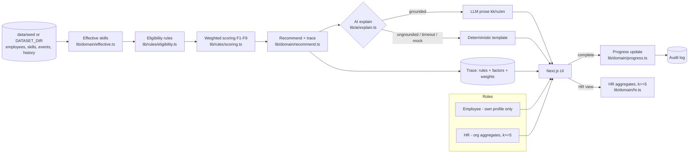

# Career Quest — Halyk Bank Case 1

Internal HR tool: for one employee it shows the career trajectory to their next
grade and 1–3 eligible, voluntary development steps that close the gap, each
with a rationale grounded in ≥ 3 factors. Completing a step moves projected
skill levels. HR sees lagging skills, who has no recommended step, and
participation by activity.

**HackAlem AI 2026 · Finance track · Task: Halyk Bank "Career Quest" (Case 1)**

> **Runs with no API key and no personal account.** `cp .env.example .env` and
> the app works fully offline against a deterministic model (`MODEL_REF=mock:demo`).
> See [Setup](#10-setup).

---

## 1. Problem

Today, per the case brief: development activities arrive as separate HR
notifications with deadlines. The employee cannot see where a given activity
leads. Training gets done as a formality on the deadline day, and turnout for
voluntary activities is low even though the development budget is fully spent.
Coercion is named in the brief as "the main predictor of failure" for such
programs.

## 2. Solution

A deterministic rules engine (`lib/rules/`, `lib/domain/`) computes, per
employee: effective skill levels (assessed level plus post-review completions),
the gap to their target grade, eligible voluntary events, and a weighted
multi-factor score with a full trace. **The engine selects and ranks; a
language model only writes the rationale prose** from the engine's own factor
list (`lib/ai/explain.ts`, via `generateStructured`), and that text is
rejected and replaced by a deterministic template if it names any number, skill
or event the engine did not produce (`lib/ai/grounding.ts`). Nothing about
eligibility, ranking or skill arithmetic is decided by the model.

## 3. Exact challenge requirements

From the case brief (`docs/task/halyk-career-quest-spec.txt`, EN §7 "Must
have"), quoted via `docs/requirements.md`:

> Profile and career trajectory — open any employee, see role, grade, skills,
> completed activities, available next steps. AI recommendation of the next
> step — the system suggests 1–3 relevant activities, and the rationale relies
> on at least three factors (grade, skill gaps, participation history,
> next-level requirements). Progress update — mark an activity completed, skill
> progress and the trajectory move. Simple HR view — lagging skills, who has no
> recommended step, participation by activity. Infrastructure — launch with a
> single command. The jury uses three profiles designed so that a single-factor
> rule gets them wrong.

## 4. Requirement completion matrix

| ID | Requirement | Implementation | Evidence | Status |
| --- | --- | --- | --- | --- |
| R-01 | Employee profile: role, grade, skills, history, next steps | `app/employee/[id]/page.tsx`, `lib/domain/trajectory.ts` | `tests/trajectory.test.ts`, `tests/engine.test.ts` | ✅ |
| R-02 | Career trajectory with per-skill gap | `lib/domain/trajectory.ts` | `tests/trajectory.test.ts` | ✅ |
| R-03 | 1–3 eligible voluntary recommendations | `lib/domain/recommend.ts`, `lib/rules/eligibility.ts` | `tests/engine.test.ts` | ✅ |
| R-04 | Rationale cites ≥ 3 distinct factors with numbers | `lib/rules/scoring.ts` (F1–F9), `lib/ai/explain.ts` | `tests/engine.test.ts`, `tests/explain.test.ts` | ✅ |
| R-05 | Complete → skill progress + trajectory move | `lib/domain/progress.ts`, `app/api/employees/[id]/complete/route.ts` | `tests/progress.test.ts` | ✅ |
| R-06 | HR view: lagging skills, no-step list, participation | `lib/domain/hr.ts`, `app/hr/page.tsx` | `tests/hr.test.ts` | ✅ |
| R-07 | "No recommended step" with a reason code | `lib/domain/recommend.ts` (`NoStepReason`) | `tests/engine.test.ts` (fixture F-05) | ✅ |
| R-08 | Beats single-factor baselines on trap profiles | `lib/rules/scoring.ts`, fixtures `data/fixtures/trap-F01..F05` | `tests/engine.test.ts` (F-01..F-05 assertions) | ✅ |
| R-09 | Import new profiles/history via UI **and** CLI | `lib/data/import.ts` (validation, upsert, atomic overlay write) | none yet | ⚠️ partial — core import logic exists; no route, UI page or CLI wires it up yet, so a judge cannot invoke it. See [Known limitations](#19-known-limitations) |
| R-10 | Latency: UI ≤ 2 s, AI ≤ 10 s with 8 s fallback | `lib/ai/explain.ts` (`AbortSignal` timeout → template) | `tests/explain.test.ts` | ⚠️ partial — timeout/fallback exists; no dedicated timing benchmark test |
| R-11 | Explainability: visible trace + progress formula | `components/TraceView.tsx`, `lib/rules/engine.ts` | `tests/engine.test.ts`; visible in UI | ✅ |
| R-15 / R-16 | Employee/HR role separation, fails closed, no cross-employee data | `lib/auth/session.ts`, route guards | `tests/authz.test.ts` | ✅ |
| R-17 | Voluntary; dismiss without penalty | `app/api/employees/[id]/dismiss/route.ts` | `tests/trajectory.test.ts` | ✅ |
| R-18 | UI and rationale in kk/ru/en | `lib/i18n/dict.ts` | `tests/i18n-keys.test.ts` | ⚠️ partial — key sets match and `en` is complete; `kk`/`ru` are placeholder clones of `en`, not yet translated |
| R-12 | Single-command launch, no keys | `Dockerfile`, `docker-compose.yml`, `pnpm start:demo` | `scripts/clean-room-test.sh` | ✅ |
| R-13 | Testable with no personal account | `MODEL_REF=mock:demo` default, demo login picker | clean-room script runs offline | ✅ |

✅ complete and tested · ⚠️ partial · ❌ not implemented

## 5. Main user scenario — procedure for checking it

Everything below is reproducible from a clean clone; run [Setup](#10-setup)
first, then follow these steps.

1. Open `http://localhost:3000` → **Log in** → pick employee **E0028** (Backend
   Engineer, Middle grade — the case brief's own worked example) → submit.
2. `/employee/E0028` loads. **Expected:** System Design shows *assessed 2 →
   effective 3* (a pending gain from completed event EV_006, dated after the
   last review), flagged critical for Senior (requires 4).
3. The recommendation panel shows **1–3 cards**. **Expected:** each card has an
   expandable trace with **≥ 3 distinct factor kinds** (e.g. grade,
   skill_gap, next_level_requirement, participation_history), each with a
   concrete number, plus a rule pass/fail list and the score. The top pick is a
   System Design event, not the lowest raw skill on the profile.
4. Click **Complete** on that recommendation. **Expected:** a before → after
   panel shows System Design moving via `min(level + gain, max_level)`, the
   trajectory gap shrinks, and the recommendation list refreshes.
5. Log out, log back in as **HR** (button on the login page, no password).
   `/hr` loads. **Expected:** three panels — lagging skills (counts, cells with
   fewer than 5 employees show `<5` instead of a number), employees with no
   recommended step (with a reason code), and participation by event.
6. **Trap-profile check (R-08):** run `pnpm test tests/engine.test.ts`, which
   asserts, against `data/fixtures/trap-F01..F05.json/.csv`, that the top
   recommendation on each fixture differs from both the "lowest skill" and
   "largest raw gap" baselines — the failure mode the case brief names
   explicitly.
7. **Jury profile upload:** the case brief states the jury uploads test
   profiles at the defense in the dataset's own JSON/CSV shape. This import
   path (`lib/data/import.ts`, `app/hr/import`, `app/api/hr/import`,
   `pnpm data:import`) is **planned in `docs/plan.md` (task T5) but not yet
   built** — see [Known limitations](#19-known-limitations) for the workaround.

## 6. Architecture



One Next.js 16 app, one process, file-backed store — no DB, ORM, queue, vector
store or auth provider (`docs/architecture.md` §10, `docs/adr/`). The model
proposes explanation text only; every eligibility, scoring and skill-arithmetic
decision is code in `lib/rules/` and `lib/domain/`, each with a recorded trace.

## 7. AI architecture

- **One AI call total**: `explain(recommendation, locale)`. The model receives
  only the engine's own factor trace — no raw history rows, no other
  employees' data — and returns `{headline, why[], expected_progress}` via
  `generateStructured` (Zod-validated).
- **Grounding check** (`lib/ai/grounding.ts`): every number, skill id and event
  id in the text must already appear in the factors, and ≥ 3 distinct factor
  kinds must be cited. Any failure — timeout (8 s), provider error, ungrounded
  text — falls back to `lib/ai/template.ts`, and the UI badges the source
  ("AI" vs "template") honestly.
- **Offline mode**: `MODEL_REF=mock:demo` (default) uses `lib/ai/scenarios.ts`,
  which echoes the real factors, so grounding passes identically offline.

| Concern | Handled by |
| --- | --- |
| Eligibility (role/grade/prereqs/session/cap) | `lib/rules/eligibility.ts` |
| Scoring and ranking | `lib/rules/scoring.ts` |
| Skill arithmetic (`min(level+gain, max)`) | `lib/domain/growth.ts` |
| Rationale prose, kk/ru/en | model, via `lib/ai/explain.ts` |
| Authorization | `lib/auth/session.ts` + route guards |

## 8. Security model

| Actor | May | May not |
| --- | --- | --- |
| Employee | read/act on own profile and recommendations; complete/dismiss own events | read another employee's profile or history; see HR aggregates |
| HR | read org aggregates and the no-step list (audited); open an individual profile (audited) | change scoring config in the UI (not built); is never shown a leaderboard (none exists) |

- Every route runs `parseBody`/`withErrorHandling` and an auth guard **before**
  data is loaded — `requireEmployeeSelf` / `requireHr` fail closed
  (`tests/authz.test.ts`).
- Session identity is a signed HttpOnly cookie (`cq_session`, HMAC-SHA256);
  the URL's `[id]` is never trusted on its own.
- `complete`, `dismiss` and HR profile views emit `recordAudit` (`lib/audit/audit.ts`).
- HR aggregate cells with fewer than 5 employees are suppressed (`{suppressed:true}`, `lib/domain/hr.ts`), not just hidden in the UI.
- No leaderboards or cross-employee rankings exist as a route (case brief
  prohibition).
- All dataset content is synthetic (`data/seed/`); no real names, IINs or case
  numbers. Details: `docs/threat-model.md`.

## 9. Technology choices

| Choice | Why | Alternative rejected |
| --- | --- | --- |
| Next.js 16, one process | UI + API routes together; nothing extra for a judge to run | separate API service: no benefit at this scale |
| File-backed store (`lib/store/jsonl.ts`) | no daemon, trivially seedable, resettable | Postgres: a service a judge would have to run |
| Zod 4 | one schema for HTTP bodies, dataset rows and model output | hand-written guards |
| AI SDK 7 + `generateStructured` | provider-agnostic; the same code path runs against `mock:demo` or a real key | direct provider SDK calls |

## 10. Setup

**No API key and no personal account are required to run or test the app.**

```bash
git clone <repo> && cd <repo>
nvm use                          # Node 24 (.nvmrc)
cp .env.example .env             # works as-is
corepack enable                  # once per machine, gives pnpm 12.4.2
pnpm install --frozen-lockfile
pnpm build
pnpm start                       # http://localhost:3000
```

Or, in one line, matching `package.json`'s `start:demo` script:

```bash
nvm use && pnpm install --frozen-lockfile && pnpm build && pnpm start
```

Or Docker (see [§13](#13-docker)) if you prefer not to install Node at all.

## 11. Environment variables

From `.env.example`:

| Variable | Required | Default | Purpose |
| --- | --- | --- | --- |
| `MODEL_REF` | no | `mock:demo` | `<provider>:<model>`. `mock:demo` runs fully offline, no key. All tests and the clean-room check run in this mode |
| `OPENAI_API_KEY` | only for `openai:*` | — | never committed |
| `ANTHROPIC_API_KEY` | only for `anthropic:*` | — | never committed |
| `DATA_DIR` | no | `./data` | file-backed store location (completions, dismissals) |
| `DATASET_DIR` | no | — | override the seed dataset location; used to load the **organizer's kit** (`docs/task/career_quest_dataset/`) without committing it. If unset, resolution falls back to that path if present, else the committed `data/seed/` |
| `DEFAULT_LOCALE` | no | `ru` | `kk` \| `ru` \| `en` |
| `PORT` | no | `3000` | |
| `APP_VERSION` | no | `0.1.0` | shown on `/api/health` |
| `SESSION_SECRET` | no (demo) | `demo-session-secret-insecure-change-me` | signs the `cq_session` cookie. This demo default is deliberately public and is used by `pnpm start` and the Docker image; `NODE_ENV=production` refuses to start without **some** value set, so the default exists precisely so the single-command launch works. Set a real value (`openssl rand -base64 32`) for any non-demo deployment |

## 12. Running locally

```bash
pnpm dev                    # development, hot reload
pnpm build && pnpm start    # production build, matches Docker
```

## 13. Docker

```bash
docker compose up --build   # http://localhost:3000, offline by default
```

Health check: `curl http://localhost:3000/api/health`.

## 14. Tests

```bash
pnpm test        # unit and integration (offline, no key needed)
pnpm typecheck
pnpm verify       # full sequence: lint, typecheck, test, build
```

Current suite covers: eligibility/scoring/effective-skill arithmetic and the
five trap fixtures (`tests/engine.test.ts`), trajectory and dismiss
(`tests/trajectory.test.ts`), progress updates (`tests/progress.test.ts`), HR
aggregation and k-suppression (`tests/hr.test.ts`), authorization
(`tests/authz.test.ts`), AI explanation and grounding fallback
(`tests/explain.test.ts`), i18n key parity (`tests/i18n-keys.test.ts`). Run
`pnpm test` to see current pass/fail counts.

`pnpm test:e2e` (Playwright) and `pnpm eval` (promptfoo) are configured in
`package.json` but were not exercised as part of this README pass — do not
assume their output without running them.

## 15. AI evaluations

```bash
pnpm eval     # promptfoo, runs against mock:demo, no credentials needed
```

Config: `promptfoo.yaml`, cases under `eval/cases/`. Grounding is additionally
enforced in-product (`lib/ai/grounding.ts`) and covered by
`tests/explain.test.ts`, independent of the promptfoo suite.

## 16. Demo instructions

```bash
pnpm demo:reset   # restores data/seed as the working state
pnpm demo:seed    # (re)writes committed demo overlays
pnpm dev
```

Then follow [§5](#5-main-user-scenario--procedure-for-checking-it). No
screenshot capture (`pnpm screenshots`) has been committed to this README pass;
none is claimed here that was not produced by running the app.

## 17. Deployment

No public URL is deployed. Per the case brief's data-residency condition
("the data is synthetic and may not be taken outside the hackathon"), no
hosted instance with the dataset loaded is made public. Docker
([§13](#13-docker)) is the supported reproducible path anywhere.

## 18. External materials disclosure

Full record: [`EXTERNAL_MATERIALS.md`](EXTERNAL_MATERIALS.md).

Summary: the HackAlem preparation kit supplied agent/skill configuration,
templates, CI, and a scaffold of provider/store/validation utilities (listed
individually with checksums). All domain logic — eligibility, scoring,
trajectory, progress, HR aggregation, the demo UI, and the synthetic seed
dataset — was written during the competition; commit history is the evidence.

## 19. Known limitations

- **R-09, jury profile upload is not usable end-to-end yet.**
  `lib/data/import.ts` implements the validation/upsert logic, but
  `app/api/hr/import`, `app/hr/import`, and `scripts/import.mjs` (referenced by
  the `pnpm data:import` script in `package.json`) do not exist yet in this
  repository, so there is no route, page or CLI a judge can actually run. The
  documented workaround: set `DATASET_DIR` to a folder
  containing the jury's `employees.json`/`activity_history.csv` in the same
  schema as `data/seed/`, and restart the app — `lib/data/load.ts` resolves
  `DATASET_DIR` before falling back to the committed seed. This requires a
  restart, unlike the planned live-upload UI in `docs/plan.md` (task T5).
- **R-10 has no dedicated latency benchmark test.** The 8-second AI timeout and
  deterministic-template fallback exist and are covered by
  `tests/explain.test.ts`, but p95 response time is not separately measured.
- **kk and ru UI/rationale text are placeholders**, not real translations —
  `lib/i18n/dict.ts` clones the `en` dictionary for both. Key sets are
  identical and tested (`tests/i18n-keys.test.ts`); the *content* is English
  text under `kk`/`ru` keys.
- **Out of scope by design** (`docs/architecture.md` §9): real SSO/auth, the
  manager-consent role (matrix documented in `docs/domain.md`, not built), HR
  scoring-config approval workflow, session booking, the LLM choosing/
  re-ranking events (it only explains what the engine already picked),
  RAG/embeddings, gamification, the HR event builder, .ics export, grade-
  transition simulation, and write concurrency safety in the file store —
  acceptable for a single-demo-instance judged artifact.
- `pnpm test:e2e` and `pnpm eval` are configured but were not run as part of
  writing this README; their current pass/fail state is unverified here.

## 20. Future scalability

| Step | Trigger | Change |
| --- | --- | --- |
| Build the import path (T5 in `docs/plan.md`) | any real upload need | `lib/data/import.ts` + `app/api/hr/import`, already scoped in `docs/architecture.md` §1 |
| Postgres | > 200 employees or concurrent writes | swap `lib/store/jsonl.ts`, keep `getDataset()`'s interface |
| Real identity | production pilot at Halyk | replace the demo login picker with SSO behind the same `lib/auth/session.ts` contract |
| Manager consent flow | production pilot | the permission matrix is already documented in `docs/domain.md`; add the consent toggle and a manager route |
| Real kk/ru translation | before any non-demo use | replace the placeholder clones in `lib/i18n/dict.ts`, key set already frozen |

Module boundaries (`lib/rules/` vs `lib/domain/` vs `lib/ai/`) were chosen so
each of these is a contained change.

---

## Краткое описание (Русский)

**Проблема.** Обучающие мероприятия приходят как отдельные уведомления с
дедлайнами; сотрудник не видит, к чему ведёт шаг. Явка на добровольные
активности низкая.

**Решение.** Детерминированный движок (`lib/rules/`, `lib/domain/`) считает
эффективный уровень навыков, разрыв до следующего грейда и 1–3 подходящих
добровольных шага с весовой оценкой по ≥ 3 факторам (грейд, разрыв навыков,
история участия, требования следующего уровня). Языковая модель только
формулирует текст обоснования по готовому трейсу движка и отклоняется, если
использует цифру или id, которых не было в трейсе (`lib/ai/grounding.ts`).

**Запуск (без ключа API и без личного аккаунта команды):**

```bash
nvm use && pnpm install --frozen-lockfile && pnpm build && pnpm start
```

**Известное ограничение.** Загрузка тестовых профилей жюри через интерфейс
(R-09) пока не реализована; временное решение — переменная `DATASET_DIR`. Тексты
на kk/ru — пока заглушки (копия en).
