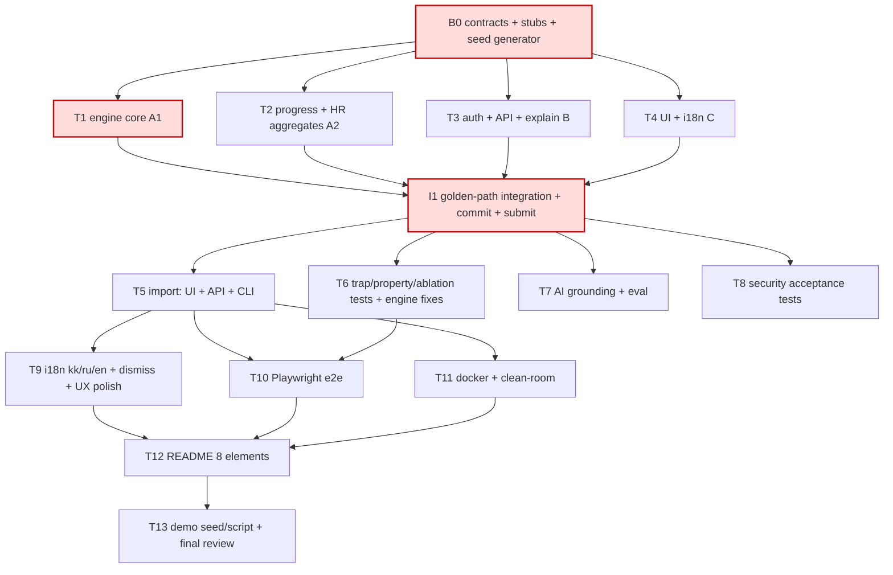

# Plan — Halyk Career Quest

Owner: `implementation-planner` · written 13:48 Astana (T+00:48) · Inputs: `docs/architecture.md`, `docs/requirements.md`, ADR 0006–0008, `docs/threat-model.md`, `docs/domain.md`.

Clock: now 13:48 · **golden path green 15:00** · upload landed **before 16:00** · feature freeze **17:30** · final 18:00.
Estimates are agent wall-clock and include a buffer. A batch costs the time of its slowest member.

## Golden path (the one scenario that proves the product)

Log in as E0028 → `/employee/E0028` shows System Design assessed 2 → effective 3 (EV_006 pending gain), critical for Senior 4 → 1–3 recs, each with ≥ 3 factor kinds and a template or mock explanation → **Complete** → SD 3→4 in the before/after panel, and the recs refresh → HR login → `/hr` shows 3 panels.
Upload (`/hr/import`) is Batch 2, and it must land before 16:00.

---

## Dependency graph

**Critical path:** B0 (15) → T1 (45) → I1 (10) = **70 min**, which puts the golden path at ~15:00 if B0 starts by 13:50. Slack to 15:00 is **about zero**, so every critical task has a pre-named fallback with a trigger time (see below).
After 15:00 the chain is I1 → T5 (45) → T11 (30) → T12 (30) → T13 (30), which ends ~17:15 and leaves **15 min of slack before the 17:30 freeze**. T9 and T10 run beside T11.

---

## Batch 0 — serial, 13:50–14:05 (≤ 15 min), one agent (`backend-engineer`)

B0 creates every file that a later task imports but does not own yet. **No Batch 1 task may create any file in this list.** B0 only creates them. The named owner fills them in.

| Path | B0 writes | Filled by |
| --- | --- | --- |
| `lib/contracts.ts` | The full zod schemas from architecture §3, then **frozen** | nobody (a change needs a note in architecture.md) |
| `lib/data/load.ts` | `getDataset()`, `invalidateDataset()`: a **real** minimal loader (JSON + CSV via a 40-line parser inline for now) that resolves `DATASET_DIR` → `docs/task/career_quest_dataset/` → `data/seed/` | T1 (hardening + overlays) |
| `lib/domain/trajectory.ts`, `lib/domain/recommend.ts` | Signature-only stubs. They throw `new Error("NOT_IMPLEMENTED")` | T1 |
| `lib/domain/progress.ts`, `lib/domain/hr.ts` | Signature-only stubs | T2 |
| `lib/auth/session.ts` | Signature-only stubs (`getSession`, `requireEmployeeSelf`, `requireHr`) | T3 |
| `lib/ai/explain.ts` | A stub that returns `templateExplanation` placeholder text | T3 |
| `lib/i18n/dict.ts` | `{en:{}, ru:{}, kk:{}}` plus a `t(locale,key)` export | T4 |
| `scripts/gen-seed.mjs` | A deterministic generator (fixed PRNG seed). It writes `data/seed/{skills.json,events.json,employees.json,activity_history.csv}` with the same schema: ~40 employees with fictional ids `E0001…` and fictional names such as "Demo Person 07". The events/skills/role_profiles are **authored by us** in the kit's shape. It **must include an E0028-shaped profile** (Backend Middle, SD 2, review 2026-06-24, EV_006 completed 2026-09-08, EV_009 dropped ×2). It also writes `data/fixtures/trap-F01…F06.{json,csv}` (ids T9001+, names "Test Trap-One" …) | — (generated output is **committed**) |
| `package.json` | Adds **all** script entries now: `gen:seed`, `data:import`, `start:demo`. No later task edits `package.json` except T11 | T11 |

Acceptance: `node scripts/gen-seed.mjs && git diff --exit-code data/` (running it twice gives the same bytes) · `pnpm typecheck` passes · `node -e` loads the seed through `getDataset()` and prints the employee count · commit `B0: frozen contracts, stubs, synthetic seed generator (R-12, R-13, N-04)`.
**Fallback (trigger 14:05):** if the generator is not done, hand-write `data/seed/*` with 6 employees (E0028-shape + F-01…F-05) and move on. Generator parity moves to Batch 2.

---

## Batch 1 — golden path, 14:05–14:50 in parallel, then I1 14:50–15:00

Every path belongs to exactly one task. Tasks talk to each other only through `lib/contracts.ts` and the B0 stub signatures.

| id | Owner agent | Files owned (exclusive) | Depends | Budget | Acceptance (command) | REQ | Eff | Parallel-safe |
| --- | --- | --- | --- | --- | --- | --- | --- | --- |
| **T1** Engine core (critical) | `backend-engineer` #1 | `lib/data/{schemas,csv,load}.ts`, `lib/domain/{effective,growth,trajectory,history,recommend}.ts`, `lib/rules/{eligibility,scoring}.ts`, `tests/{engine,trajectory,eligibility}.test.ts` | B0 | **45** | `pnpm test tests/engine tests/trajectory tests/eligibility`: E0028 effective SD 3, critical gap vs Senior 4; top rec develops SD; every rec has ≥ 3 distinct factor kinds; no mandatory or ineligible rec over all seed employees | R-01–R-04, R-07, R-11, I-01–I-08, N-01, N-03 | M | yes |
| **T2** Progress + HR | `backend-engineer` #2 | `lib/domain/{progress,hr}.ts`, `tests/{progress,hr}.test.ts` | B0 (codes against the T1 signatures; tests use `vi.mock` until T1 lands) | 30 | `pnpm test tests/progress tests/hr`: `applyGrowth` cap, E0028 completes an SD event → SD 3→4, `completions.jsonl` appended, `recordAudit` called; HR counts with n < 5 suppressed; no-step list sorted by id | R-05, R-06, R-07, I-12, I-13, N-02 | S | yes |
| **T3** Auth + API + explain | `agent-engineer` | `lib/auth/session.ts`, `lib/ai/{explain,grounding,template}.ts`, `lib/ai/scenarios.ts` (the explain scenario), `app/api/session/route.ts`, `app/api/employees/route.ts`, `app/api/employees/[id]/{route,recommendations/route,explanations/route,complete/route,dismiss/route}.ts`, `app/api/hr/aggregates/route.ts`, `tests/{authz,explain}.test.ts` | B0 | 40 | `pnpm test tests/authz tests/explain`: no cookie → 401 before data is touched; employee→other id → 403; employee→`/api/hr/*` → 403; a mock explanation passes grounding; an ungrounded number → template fallback with `source:"template"` | R-10, R-13, R-15, R-16, I-09, N-01 | M | yes |
| **T4** UI + i18n | `frontend-engineer` | `app/page.tsx`, `app/login/page.tsx`, `app/employee/[id]/page.tsx`, `app/hr/page.tsx`, `components/{TraceView,GapTable,RecCard,LangSwitch,RoleBar}.tsx`, `lib/i18n/dict.ts`, `components/__samples__.ts` (contract-valid sample data for developing before T1 lands), `tests/i18n-keys.test.ts` | B0 | 45 | `pnpm typecheck && pnpm test tests/i18n-keys` (identical key sets in en/ru/kk; en complete, ru/kk may be English placeholders) · `pnpm build` passes | R-01, R-02, R-05 (UI), R-06 (UI), R-11, R-17 (button), R-18 (keys) | M | yes |
| **I1** Integration | orchestrator + `qa-engineer` | none new. It fixes only inside the owner's files, with the owner's agent | T1–T4 | 10 | `pnpm verify` green, then a manual walk of the golden path on `pnpm dev` · **commit + push + "Submit Solution" on the tracks page** | R-12 partial | S | no |

Batch 1 costs max(45, 30, 40, 45) = 45 min.
Out of bounds for Batch 1: nobody creates `app/api/hr/import/route.ts`, `lib/data/import.ts` or `app/hr/import/page.tsx`. They belong to T5. The HR page links to `/hr/import`, and a 404 there is acceptable until 15:45.

### Critical-path fallbacks (each can be swapped in without waiting for the original)

| Task | Trigger | Cheaper version that still meets the requirement |
| --- | --- | --- |
| T1 | 14:35 without green engine tests | Score with 4 factors only: F1 skill_gap × critical, F2 next_level_requirement, F3 grade (audience), F4 participation_history (negative count on shared skill). This is still ≥ 3 kinds (R-04, N-01). Diversity, effort fit and session soonness move to T6 |
| T2 | 14:40 | HR: lagging skills and no-step list only, with participation as raw counts and suppression kept. Progress without refreshed recs: the page re-fetches them instead |
| T3 | 14:40 | Explanation = `template.ts` only (`source:"template"`). The LLM path moves to T7. Auth is **never** cut, only simplified (an HMAC cookie with a fixed dev secret) |
| T4 | 14:40 | One server-rendered `/employee/[id]` page with plain tables, plus `/hr` with 3 plain tables. No components. Trace as a `
` JSON dump |
| I1 | 15:00 not green | Commit what runs, with a message that says what is blocked. Keep integrating until 15:15 at the latest, then start Batch 2 anyway with T6 working on the blocker |

---

## Batch 2 — 15:00–16:30

**2a (15:00–15:45)**. Batch cost 45.

| id | Owner agent | Files owned | Depends | Budget | Acceptance | REQ |
| --- | --- | --- | --- | --- | --- | --- |
| T5 Upload/import | `backend-engineer` | `lib/data/import.ts`, `app/api/hr/import/route.ts`, `app/hr/import/page.tsx`, `scripts/import.mjs`, `tests/import.test.ts` | I1 | 45 | Uploading `data/fixtures/trap-F01.json` + `.csv` → T9001 opens and gets recs with no restart; a bad row gives a field error while the valid rows import; 413 over 5 MB; HR only. `pnpm data:import data/fixtures` works | R-09, I-10 |
| T6 Trap + property + ablation | `qa-engineer` (may edit `lib/rules/*`, `lib/domain/{recommend,history,effective,trajectory}.ts`: T1 is finished, so T6 now owns these) | `tests/{trap-profiles,ablation,property}.test.ts` + the engine files above | I1 | 45 | F-01…F-05 top rec differs from the lowest-skill and largest-gap baselines; removing any one factor flips ≥ 1 fixture; 0 ineligible recs across all employees | R-03, R-07, R-08, N-01 |
| T7 AI grounding polish | `agent-engineer` | `lib/ai/*` (except `structured.ts`, `provider.ts`), `evals/*` | I1 | 40 | `pnpm eval` passes: no number in the text is missing from the factors; kk/ru/en mock scenarios; an 8 s timeout falls back | R-04, R-10, R-18, I-09 |
| T8 Security acceptance tests | `security-engineer` | `tests/{security,prohibitions}.test.ts` only (fixes go to T3's route files, done by T3's agent after 2a) | I1 | 30 | Threat-model acceptance tests pass: no leaderboard/rank routes; employee responses never contain foreign ids; cookie tampering → 401; import ids match `^[A-Z0-9_]+$` | R-15, R-16, N-02–N-04 |

**Fallback T5 (trigger 15:40):** CLI plus a drop-folder only (`DATASET_DIR` overlay, loaded through `invalidateDataset`). The upload page shows the documented command. R-09 is still met, and the README states it.

**2b (15:45–16:30)**. Batch cost 45.

| id | Owner | Files | Budget | Acceptance | REQ |
| --- | --- | --- | --- | --- | --- |
| T9 i18n + dismiss + polish | `frontend-engineer` | `lib/i18n/dict.ts`, `app/**/page.tsx`, `components/*` | 40 | Real kk/ru strings; E0028 (kk) renders in kk; dismiss removes the event; no coercive wording | R-17, R-18, N-05 |
| T10 Playwright e2e | `qa-engineer` | `e2e/*.spec.ts`, `playwright.config.ts` | 40 | `pnpm test:e2e` passes the golden path, the HR 3 panels and the upload | R-01, R-05, R-06, R-09, R-11 |
| T11 Docker + clean-room | `devops-engineer` | `Dockerfile`, `docker-compose.yml`, `.env.example`, `package.json`, `scripts/clean-room-test.sh` | 30 | `bash scripts/clean-room-test.sh` passes offline in mock mode | R-12, R-13 |

---

## Batch 3 — 16:30–17:30 (freeze)

| id | Owner | Files | Budget | Acceptance |
| --- | --- | --- | --- | --- |
| T12 README | `technical-writer` | `README.md`, `EXTERNAL_MATERIALS.md` | 30 | All 8 elements (R-14), including the upload format, the trap-case employee ids, the deterministic-vs-LLM statement (N-01c), the requirement status matrix and honest known limitations |
| T13 Demo + final | `demo-engineer`, then `final-reviewer` | `scripts/demo.mjs`, `docs/demo-script.md` | 30 | `pnpm demo:reset && pnpm demo:seed` deterministic; clean-room is re-run on the final commit; the submission on the tracks page is updated |

17:30–18:00: fixes only. No features. Last commit by 17:50.

---

## Scope ladder (the first item on this list is dropped first)

1. O-01…O-06 (transition modelling, gamification, event builder, .ics). None of these is scheduled.
2. Visual polish in T9 (keep the keys and the kk/ru text).
3. T7's real-LLM path (keep the mock + template, which fully meets R-10 and R-13).
4. Scoring factors F6–F9 (effort fit, session soonness, format fit), as long as ≥ 3 kinds and the ablation still pass.
5. Upload UI → CLI + drop folder (the T5 fallback).
6. Dismiss persistence → exclusion within the session (R-17 degraded, button kept).

**Never cut:** R-01…R-15, N-01…N-04, I-01…I-08, the README with 8 elements, the clean-room pass.
